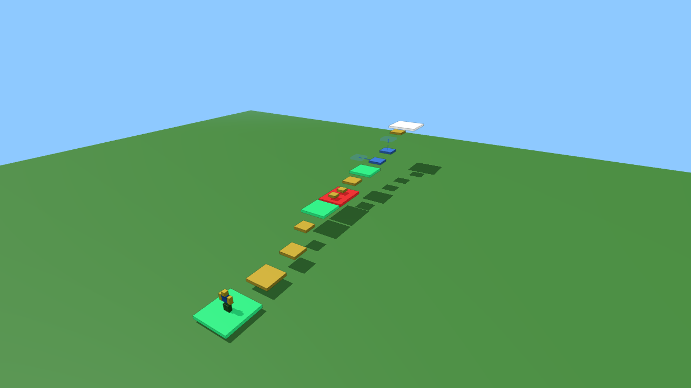
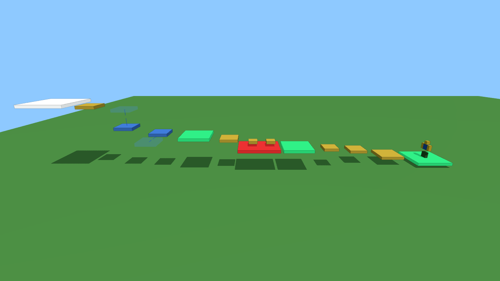

# rb_game — своя карта для Roblox

Obby-карта, описанная кодом. Готовый файл карты: [`rb_game.rbxlx`](rb_game.rbxlx).




Превью отрисованы из `MapConfig.luau` (three.js), а не сняты в Roblox: геометрия и цвета те же,
графика проще. Зелёный — чекпоинт, жёлтый — платформа, красный — убивает, синий — движется
(полупрозрачный — где окажется), белый — финиш.

## Честно про телефон

Roblox Studio — единственный официальный редактор карт — работает только на Windows и macOS.
На Android/iOS его нет, и ни одно приложение из магазина его не заменяет.
Поэтому схема такая: **карту пишем кодом с телефона, открываем и публикуем — с любого ПК**.

## Что поставить на телефон

| Приложение | Зачем |
|---|---|
| **GitHub** (Play Market / App Store) | смотреть и править файлы этого репозитория |
| **Claude** | просить менять карту: «добавь 5 платформ», «сделай лаву» |
| **Roblox** | играть в опубликованную карту и тестировать её |

## Как менять карту с телефона

1. Открой `src/shared/MapConfig.luau` — там все платформы, цвета, высоты.
2. Поменяй числа или добавь строку в `MapConfig.Stages`:
   ```lua
   { Kind = "Platform", Position = Vector3.new(6, 24, 141), Size = Vector3.new(6, 1, 6) },
   ```
   Типы: `Platform`, `Kill` (убивает), `Moving` (двигается, нужны `Offset` и `Time`),
   `Checkpoint` (сохранение; `Finish = true` — финиш).
3. После каждого коммита GitHub Actions сам пересобирает `rb_game.rbxlx` и кладёт его
   в репозиторий (копия — во вкладке **Actions → Build map → Artifacts**).

## Как опубликовать (нужен ПК один раз: дома, в техникуме, у друга)

1. Установить Roblox Studio: https://create.roblox.com → Start Creating.
2. Открыть `rb_game.rbxlx` (File → Open from File).
3. Нажать Play — проверить.
4. File → Publish to Roblox. После этого карта доступна с телефона в приложении Roblox.

Чтобы править карту мышкой в Studio: нажми Play, выдели в Explorer `Workspace/Map`,
скопируй (Ctrl+C), останови игру и вставь (Ctrl+V) в Workspace. Теперь карта — обычные
детали, а скрипт `MapBuilder` её не перезапишет.

## Структура

```
default.project.json          — проект Rojo (как код превращается в place-файл)
src/shared/MapConfig.luau     — настройки карты (правишь это)
src/server/MapBuilder.server.luau — строит карту из настроек
src/server/Stages.server.luau — чекпоинты, kill-блоки, возврат упавших
rb_game.rbxlx                 — готовый файл карты для Roblox Studio
```

Сборка вручную на ПК: `rojo build default.project.json -o rb_game.rbxlx`
(Rojo: https://rojo.space). Для живой синхронизации кода со Studio — `rojo serve`
и плагин Rojo в Studio.
